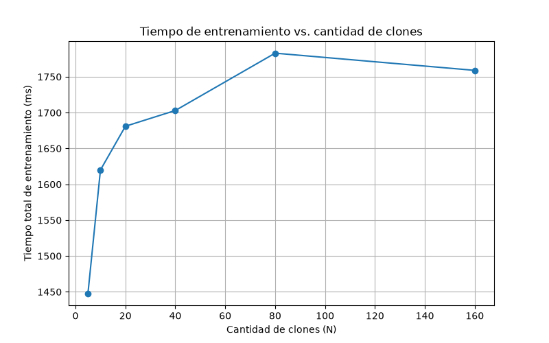

# Multi Clones de Sombra — Entrenamiento de Naruto

Simulación del entrenamiento concurrente de Naruto usando su Jutsu Multi
Clones de Sombra: cada clon entrena en su propio hilo, sin ningún
mecanismo de comunicación ni sincronización entre ellos.

## Diseño

- **`ClonDeSombra`** (`src/clon_de_sombra.*`): representa un clon. Tiene
  su propio chakra (5 a 10, aleatorio) y su propio generador aleatorio
  (`std::mt19937`), nunca comparte estado con otro clon.
- **`IEstrategiaIntento` / `EstrategiaIntentoProbabilistico`**
  (`src/intento_strategy.*`): **patrón Strategy**. Encapsula cómo se
  resuelve un intento de entrenamiento (duración 100-200 ms, 50% de
  probabilidad de subir de nivel), desacoplado de `ClonDeSombra`.
- **`FabricaClones`** (`src/clon_factory.*`): **patrón Factory Method**.
  Crea la tanda de N clones —con su chakra y semilla ya asignados— en
  un solo hilo, antes de que arranque el entrenamiento concurrente.
- **`Simulador`** (`src/simulador.*`): lanza un `std::thread` por clon,
  espera a que todos terminen (`join`) y mide el tiempo total con
  `std::chrono::high_resolution_clock`.

### Sin sincronización, sin condiciones de carrera

Cada hilo escribe su resultado únicamente en su propia posición `i` de
un `std::vector<int>` ya dimensionado *antes* de crear los hilos (nunca
se reasigna durante la ejecución). Escribir en posiciones distintas del
mismo vector desde hilos distintos es seguro sin mutex ni atomics. El
`chakra` y la `semilla` de cada clon se generan de forma secuencial en
`FabricaClones` (un solo hilo), así que tampoco hay una fuente aleatoria
compartida entre hilos durante el entrenamiento.

### Cero números mágicos

Todos los valores del enunciado están nombrados en `src/constantes.h`
(`kChakraMinimo`, `kChakraMaximo`, `kDuracionIntentoMinimoMs`,
`kDuracionIntentoMaximoMs`, `kProbabilidadSubirNivel`).

## Cómo compilar y correr

**Importante:** no ejecutes el `.exe` con la carpeta de trabajo dentro
de OneDrive. En esta máquina, correr el binario recién compilado con el
directorio de trabajo sincronizado por OneDrive provoca cierres
inesperados (segmentation fault) justo al escribir el archivo de
resultados — es una interferencia de OneDrive/antivirus con el proceso,
no un bug del programa (se verificó ejecutando el mismo binario, sin
cambiar una sola línea, desde una carpeta local: 0 fallas en 20
corridas). Por eso el script de experimentos compila y corre en
`%LOCALAPPDATA%\naruto_tp1_build` y sólo copia el CSV final al repo.

Desde VS Code (con la carpeta del repo abierta):

- `Ctrl+Shift+B` → tarea **"Naruto: compilar"**.
- Paleta de comandos → *Run Task* → **"Naruto: ejecutar experimentos"**
  (compila y corre el programa para N = 5, 10, 20, 40, 80, 160,
  guardando cada corrida en `resultados/resultados.csv`).
- Paleta de comandos → *Run Task* → **"Naruto: graficar resultados"**
  (genera `resultados/grafico_tiempo_vs_clones.png`).

O por línea de comandos, parado en esta carpeta:

```bash
python scripts/ejecutar_experimentos.py
python scripts/graficar.py
```

## Resultados

| Cantidad de clones (N) | Tiempo total (ms) | Nivel total alcanzado |
|---:|---:|---:|
| 5   | 1448 | 22  |
| 10  | 1620 | 50  |
| 20  | 1681 | 78  |
| 40  | 1703 | 145 |
| 80  | 1783 | 308 |
| 160 | 1759 | 605 |



(Valores de una corrida en una máquina de 8 núcleos lógicos; al ser un
proceso aleatorio, los tiempos y niveles exactos varían levemente entre
corridas, pero la tendencia se mantiene.)

## ¿Cuál sería la cantidad óptima de clones?

El trabajo de cada clon es **dominado por esperas (sleep), no por
cómputo**: la CPU casi no hace nada mientras un hilo "entrena", sólo
espera. Por eso el tiempo total **no escala con la cantidad de
núcleos** como pasaría con un trabajo intensivo en CPU: pasar de 5 a
160 clones (32 veces más hilos que núcleos disponibles) el tiempo total
sólo creció de ~1450 ms a ~1760 ms (+21%), muy lejos de multiplicarse
por 32. El sistema operativo puede tener miles de hilos "dormidos" en
paralelo sin competir por CPU.

Lo que sí determina el piso del tiempo total es el **clon con peor
suerte**: el que sacó más chakra (hasta 10) y más intentos lentos
(hasta 200 ms), es decir, hasta ~2000 ms en el peor caso. A medida que
aumenta N, es estadísticamente más probable que *algún* clon se acerque
a ese peor caso, por eso la curva sube un poco y se aplana cerca de ese
techo, en vez de crecer proporcional a N.

Sin embargo, agregar clones no es gratis: probamos con cientos y miles
de clones (hasta 5000) y, a partir de unos cientos, crear tantos hilos
sistema operativo de una sola vez empieza a ser inestable en esta
máquina (el proceso llega a cerrarse inesperadamente por el costo de
crear/administrar miles de hilos reales).

**Conclusión:** como el "nivel total" (la suma de avances de todos los
clones) crece prácticamente en proporción a N mientras que el tiempo
total casi no aumenta, conviene usar **la mayor cantidad de clones que
el sistema pueda manejar de forma estable, no la cantidad de núcleos
de CPU**. En esta máquina, un valor como **N = 80-160** es un buen
punto: multiplica varias veces el nivel alcanzado frente a N = 5,
manteniendo el tiempo total apenas por encima del piso natural (~2000
ms), y queda lejos de la zona donde crear tantos hilos del sistema
operativo empieza a ser inestable.
