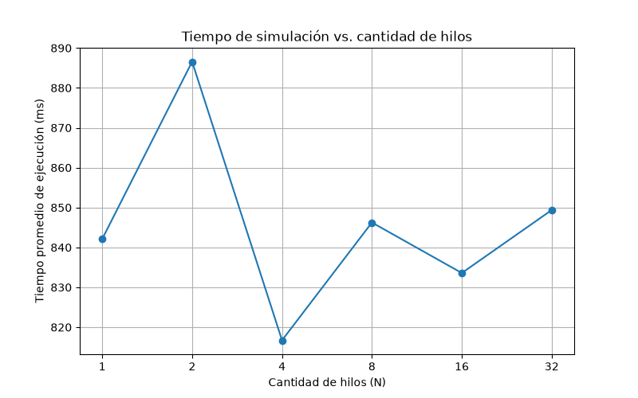

# Combates Eternos en el Netherrealm

Simulación concurrente de torneos eliminatorios de Mortal Kombat II: cada
hilo corre una porción de torneos **completos e independientes**, sin
ningún mecanismo de comunicación ni sincronización entre ellos (el único
punto de coordinación permitido es `join()` desde el hilo principal).

## Diseño

- **`Guerrero`** (`src/guerreros.py`): dataclass **inmutable** con los
  atributos de cada personaje. Al no cambiar nunca, se puede compartir
  de solo lectura entre todos los hilos sin ningún riesgo.
- **`FabricaGuerreros`** (`src/guerreros.py`): **patrón Factory Method**.
  Crea el roster fijo de 12 guerreros (valores dentro de los rangos del
  enunciado, a criterio del grupo).
- **`IEstrategiaAtaque` / `EstrategiaAtaqueClasica`** (`src/combate.py`):
  **patrón Strategy**. Resuelve un ataque (bloqueo → crítico → daño),
  desacoplado del bucle de combate.
- **`simular_combate`** (`src/combate.py`): combate por turnos; ataca
  primero quien tiene más velocidad (empate se decide al azar).
- **`simular_torneo`** (`src/torneo.py`): elige 8 de los 12 guerreros al
  azar y los enfrenta reduciendo la lista a la mitad en cada ronda
  (cuartos → semifinal → final), sin hardcodear el tamaño de cada fase.
- **`SimuladorConcurrente`** (`src/simulador.py`): reparte la cantidad
  total de torneos entre N hilos, los lanza, espera con `join()` y
  recién ahí combina los resultados para el reporte final.

### Roster elegido

| Guerrero | Vida | Ataque | Defensa | Velocidad | Crítico | Bloqueo |
|---|---:|---:|---:|---:|---:|---:|
| Liu Kang | 100 | 22 | 10 | 7 | 0.15 | 0.10 |
| Kung Lao | 90 | 24 | 8 | 8 | 0.20 | 0.10 |
| Johnny Cage | 95 | 20 | 9 | 6 | 0.25 | 0.10 |
| Reptile | 85 | 23 | 7 | 9 | 0.15 | 0.08 |
| Sub-Zero | 110 | 21 | 13 | 5 | 0.10 | 0.20 |
| Shang Tsung | 90 | 26 | 6 | 5 | 0.20 | 0.08 |
| Kitana | 88 | 22 | 8 | 9 | 0.18 | 0.12 |
| Jax | 120 | 28 | 12 | 3 | 0.10 | 0.10 |
| Mileena | 85 | 24 | 6 | 10 | 0.22 | 0.07 |
| Baraka | 105 | 27 | 9 | 4 | 0.12 | 0.10 |
| Scorpion | 95 | 25 | 8 | 6 | 0.20 | 0.10 |
| Raiden | 100 | 25 | 10 | 7 | 0.25 | 0.15 |

(No están pensados para estar balanceados entre sí — la consigna no lo
pide — sólo para estar dentro de los rangos. De hecho, en las corridas
Jax termina siendo campeón muy por encima del resto: su combinación de
vida y ataque más altos del roster compensa de sobra su baja velocidad.)

### Sin sincronización, sin condiciones de carrera

Cada hilo recibe, antes de arrancar, **su propia semilla** (generadas
todas de forma secuencial en el hilo principal, antes de lanzar ningún
hilo) y **su propia estructura `ResultadoHilo`** en una posición fija de
una lista ya dimensionada. Ningún hilo lee ni escribe el resultado o el
generador aleatorio de otro hilo, así que no hace falta lock alguno. Los
resultados sólo se combinan (`_combinar_resultados`) después de que
todos los hilos ya terminaron (`join()`), en el hilo principal.

## Cómo compilar y correr

No hace falta compilar nada. Desde VS Code (con la carpeta del repo
abierta):

- Paleta de comandos → *Run Task* → **"Netherrealm: correr una
  simulación"** (una corrida rápida de ejemplo).
- Paleta de comandos → *Run Task* → **"Netherrealm: ejecutar
  experimentos"** (corre con 1, 2, 4, 8, 16 y 32 hilos, 5 repeticiones
  cada uno, guardando cada corrida en `resultados/resultados.csv`).
- Paleta de comandos → *Run Task* → **"Netherrealm: graficar
  resultados"** (promedia las repeticiones y genera
  `resultados/grafico_hilos_vs_tiempo.png`).

O por línea de comandos, parado en esta carpeta:

```bash
python src/main.py 20000 8          # <cantidad_torneos> <cantidad_hilos>
python scripts/ejecutar_experimentos.py
python scripts/graficar.py
```

## Resultados

20.000 torneos por corrida, 5 repeticiones por cantidad de hilos,
promediando el tiempo (máquina de 8 núcleos lógicos):

| Hilos | Tiempo promedio (ms) |
|---:|---:|
| 1  | 842.1 |
| 2  | 886.6 |
| 4  | 816.7 |
| 8  | 846.2 |
| 16 | 833.6 |
| 32 | 849.4 |



## Análisis

**1) ¿Qué cantidad de hilos dio el menor tiempo?** En esta corrida,
N = 4 (~817 ms), pero las diferencias entre todas las configuraciones
(816 a 887 ms) son del orden del **ruido normal entre corridas**, no de
una mejora real: si volvés a correr el experimento, es probable que
"gane" otra cantidad de hilos. No hay una tendencia consistente donde
más hilos den menos tiempo.

**2) ¿Aumentar indefinidamente la cantidad de hilos mejora el
rendimiento?** No. Y a diferencia del TP de C++ (donde el trabajo eran
esperas y sí convenía usar muchos más hilos que núcleos), acá la
respuesta es "no" por una razón distinta y más de fondo: **el GIL
(Global Interpreter Lock) de Python**.

El CPython estándar sólo permite que **un hilo a la vez** ejecute
bytecode de Python dentro de un mismo proceso, sin importar cuántos
núcleos tenga la máquina. Como simular un combate es cómputo puro (no
hay esperas ni E/S), los hilos de Python **nunca corren en paralelo de
verdad** para este trabajo: se van turnando el GIL. Por eso pasar de 1 a
32 hilos (con la misma cantidad total de 20.000 torneos) no reduce el
tiempo total — la curva es básicamente plana, con variaciones que son
ruido de medición, no paralelismo real. Incluso podría empeorar
levemente con muchos hilos por el costo de cambiar de contexto entre
ellos sin ningún beneficio a cambio.

**Conclusión:** para este tipo de carga (CPU-bound, en Python puro), la
cantidad de hilos que usemos no cambia el tiempo total de forma
significativa. Si de verdad se necesitara acelerar este cómputo en
Python, la herramienta correcta no serían más hilos sino **procesos**
(`multiprocessing`), que sí evitan el GIL al correr en intérpretes de
Python separados — algo fuera del alcance de este TP, que pide
específicamente hilos.
