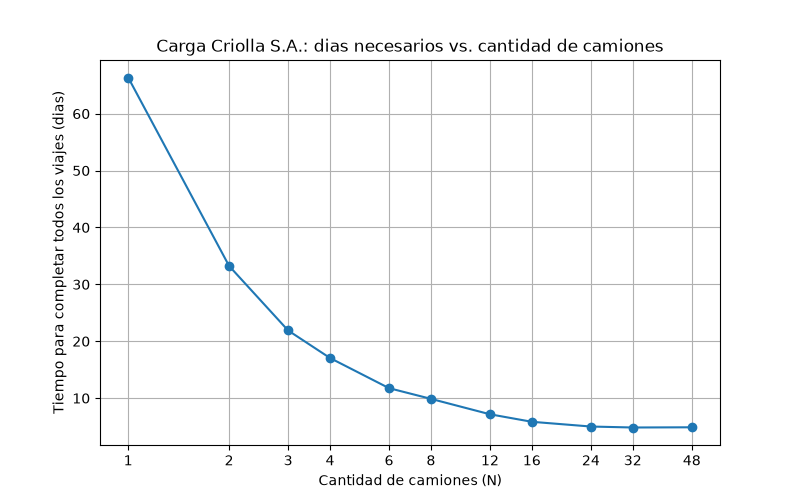

# Carga Criolla S.A. — Simulación de camiones (Java)

Simulación concurrente del recorrido de una flota de N camiones que
transporta harina (Tapiales → Fernández) y carbón (Fernández → Bs. As.)
hasta completar X viajes por planta. **Cada camión es un hilo** y se
sincronizan con semáforos y una cola de viajes pendientes. Muestra el
estado de cada camión durante la simulación y, al final, los días
necesarios para cumplir todos los viajes.

## Decisiones de diseño

El enunciado deja varios puntos abiertos; estas son las decisiones que
tomamos y por qué.

**Lenguaje: Java.** Los `Semaphore` con modo justo (`fair = true`) son
FIFO, que es exactamente lo que pide el enunciado ("el *primer* camión
disponible ingresa"); en C++ (`std::counting_semaphore`) y en Python
(`threading.Semaphore`) el orden de espera no está garantizado. Además
trae la cola concurrente y `join()` listos. La simulación es de espera,
no de cálculo, así que la velocidad de C++ no aportaba nada.

**Cantidad de viajes.**
- *X es por planta*: se generan X viajes de harina en Tapiales y X de
  carbón en Fernández (2X en total). Cada "viaje" es un trayecto con carga.

**Choferes y recorridos.**
- Cada camión tiene un chofer con **tiempo de viaje fijo** entre 18 y 24 hs
  (entero, sorteado al crear la flota). El enunciado dice "depende del
  chofer", así que ese chofer tarda lo mismo en ambos sentidos y con o
  sin carga.
- Los N camiones **empiezan en Tapiales (Bs. As.)**.

**Plantas y recursos.**
- Cada planta tiene una **zona de carga y una de descarga**, cada una un
  `Semaphore(1, fair)`. Eso cumple "máximo dos camiones a la vez (uno de
  carga y uno de descarga)".
- La **estación de servicio** de Fernández es un `Semaphore(2, fair)` (los
  dos surtidores Diesel). La tratamos como un recurso aparte: **no cuenta**
  dentro del límite de dos camiones de la planta.
- Fernández recarga combustible **después de cargar el carbón y antes de
  partir**, y el camión ya liberó la zona de carga mientras espera el
  surtidor. Tapiales no tiene estación de servicio. El trayecto en vacío
  no recarga (el enunciado sólo lo pide "ya cargados con carbón").

**Cuándo se asigna un viaje.**
- El camión **reclama el viaje recién cuando entra a la zona de carga**,
  no cuando llega a la planta. Así el orden lo define la cola FIFO de la
  zona y no una carrera por la cola de viajes. La reclamación es atómica
  (`ConcurrentLinkedQueue.poll()`).

**Camión sin viaje en su planta.**
- Si al llegar a cargar **ya no quedan viajes en su planta pero sí en la
  otra**, vuelve **vacío** (el mismo tiempo de viaje, sin recarga de
  combustible) para ayudar. Si no queda ningún viaje pendiente en ninguna
  de las dos, **finaliza su turno**. Una cola vacía nunca vuelve a tener
  viajes, así que esta decisión es segura.

**Sin deadlock.**
- Un camión **nunca retiene un recurso mientras espera otro**: suelta la
  zona de descarga antes de pedir la de carga, y la de carga antes de
  pedir el surtidor. Sin "retener y esperar" no puede haber deadlock.

**Tiempo simulado.**
- **1 hora simulada = 20 ms reales** (`MS_REALES_POR_HORA_SIMULADA`).
- Los días se miden hasta la **descarga del último viaje**; un camión que
  llega vacío tarde a una planta ya sin viajes no alarga la simulación.
- Medimos con el reloj real, así que hay algo de ruido. `Thread.sleep` en
  Windows se pasa entre 8 y 15 ms por vez, un error enorme frente a 20 ms
  por hora simulada, por eso `Reloj` duerme casi todo el intervalo y
  espera activamente el tramo final hasta una hora límite exacta. Con 1
  camión el resultado coincide con el valor teórico (2·T + 9 hs por
  ida y vuelta) con un desvío de ~2-3 %.

**Patrones de diseño.**
- **Factory Method** (`FabricaCamiones`): crea toda la flota, con su chofer
  y su tiempo de viaje, en un solo hilo antes de arrancar.
- **Observer** (`ObservadorEstado` / `RegistroConsola`): el camión informa
  cada cambio de estado sin saber qué se hace con él. En modo experimento
  se usa un observador vacío, y no hay otro código de impresión.

**Reglas de la cátedra.** Constantes con nombre en `Constantes.java` (sin
números mágicos), métodos de hasta 15 líneas y Google Java Style.

## Estructura

| Clase | Responsabilidad |
|---|---|
| `Main` | Lee `<camiones> <viajes_por_planta> [--csv]` e imprime el resultado |
| `Simulacion` | Arma las plantas, lanza un hilo por camión y espera con `join()` |
| `Camion` | Hilo: descarga → carga → (combustible) → viaja, hasta que no quedan viajes |
| `Planta` | Zonas de carga/descarga, cola de viajes y (en Fernández) surtidores |
| `Recurso` | Envoltorio de un `Semaphore` justo (zonas y surtidores) |
| `Reloj` | Tiempo simulado y espera precisa |
| `FabricaCamiones` | Factory Method de la flota |
| `EstadoCamion`, `EventoCamion`, `ObservadorEstado`, `RegistroConsola` | Estados y Observer del log |
| `Viaje`, `Carga`, `Chofer`, `ResultadoSimulacion`, `Constantes` | Datos y parámetros |

## Cómo compilar y correr

Desde VS Code (con la carpeta del repo abierta), paleta de comandos →
*Run Task*:

- **"Carga Criolla: correr simulación (4 camiones, 5 viajes por planta)"**
  (compila y corre un ejemplo mostrando el estado de cada camión).
- **"Carga Criolla: ejecutar experimentos"**: barre la cantidad de camiones
  con 30 viajes por planta y 3 repeticiones cada una, y guarda
  `resultados/resultados.csv`.
- **"Carga Criolla: graficar resultados"**: genera
  `resultados/grafico_camiones_vs_dias.png`.

O por línea de comandos, parado en esta carpeta:

```bash
python scripts/ejecutar_experimentos.py
python scripts/graficar.py
```

La simulación con un N y X propios: compilar con la tarea y ejecutar
`java -cp %LOCALAPPDATA%\carga_criolla_build cargacriolla.Main <camiones> <viajes_por_planta>`[^1].

### Ejemplo de salida (3 camiones, 2 viajes por planta)

```
[Dia 1 00:30] Camion 02 | espera zona de carga     | en Tapiales
[Dia 1 00:30] Camion 01 | espera zona de carga     | en Tapiales
[Dia 1 00:30] Camion 03 | espera zona de carga     | en Tapiales
[Dia 1 01:04] Camion 02 | cargando                 | viaje 1 (bolsones de harina) en Tapiales
[Dia 1 03:06] Camion 03 | cargando                 | viaje 2 (bolsones de harina) en Tapiales
[Dia 1 03:18] Camion 02 | parte cargado            | hacia Fernandez (21 hs)
[Dia 1 05:07] Camion 03 | parte cargado            | hacia Fernandez (24 hs)
[Dia 1 05:08] Camion 01 | parte vacio              | hacia Fernandez (20 hs)
[Dia 2 00:22] Camion 02 | descargando              | viaje 1 (bolsones de harina) en Fernandez
[Dia 2 01:10] Camion 01 | cargando                 | viaje 1 (bolsas de carbon) en Fernandez
[Dia 2 03:12] Camion 01 | cargando combustible     | surtidor Diesel asignado
[Dia 2 04:13] Camion 01 | parte cargado            | hacia Tapiales (20 hs)
```

El Camión 01 quedó último en la cola de carga, cuando los dos viajes de
harina ya estaban reclamados por los camiones 02 y 03, así que viaja vacío
a Fernández, donde hay carbón esperando.

## Verificación

Además de leer el log, comprobamos las reglas del enunciado sobre corridas
de 2 a 40 camiones (verificador que lee el log): **nunca hay dos camiones
a la vez en la misma zona de carga o descarga, nunca hay más de dos en los
surtidores, se hacen exactamente 2X cargas y 2X entregas, y todos los
camiones terminan**.

## Resultados

30 viajes por planta (60 en total), 3 repeticiones por cantidad de camiones,
tiempo promedio:

| Camiones (N) | Días | Aceleración vs. N = 1 | Eficiencia (aceleración / N) |
|---:|---:|---:|---:|
| 1  | 66,36 | 1,00× | 100 % |
| 2  | 33,23 | 2,00× | 100 % |
| 3  | 21,89 | 3,03× | 101 % |
| 4  | 17,05 | 3,89× | 97 % |
| 6  | 11,75 | 5,65× | 94 % |
| 8  | 9,88  | 6,72× | 84 % |
| 12 | 7,16  | 9,27× | 77 % |
| 16 | 5,84  | 11,36× | 71 % |
| 24 | 5,01  | 13,25× | 55 % |
| 32 | 4,84  | 13,71× | 43 % |
| 48 | 4,88  | 13,60× | 28 % |



(Con pocos camiones el sistema escala casi perfecto: duplicar la flota
divide el tiempo por dos. Los valores varían levemente entre corridas
por ser una simulación con hilos reales y tiempos de chofer aleatorios.)

## ¿Cuál es el número óptimo de camiones?

**El tiempo deja de mejorar alrededor de los 24-32 camiones.** El menor
promedio fue N = 32 (4,84 días), pero es un empate técnico con N = 48
(4,88 días) y muy cerca de N = 24 (5,01 días, apenas un 3,5 % más).

**Por qué hay un piso.** El cuello de botella es la **zona de carga**:
admite un camión a la vez y cada carga lleva 2 hs, así que cada planta
despacha como máximo un camión cada 2 hs. Cargar los 30 viajes de una
planta lleva 60 hs como mínimo, y a eso hay que sumarle el viaje de la
última carga, la recarga y la descarga final: el piso teórico ronda los
4,6 días, y lo medido (4,8-4,9) queda apenas por encima. Con más
camiones sólo hacen cola. Un ciclo completo de un camión dura unas 52 hs
y usa la zona de carga 2 hs por planta, así que unos 26 camiones ya la
mantienen ocupada de forma continua, que coincide con lo medido.

**Qué conviene.** Los camiones extra pasan de ayudar a estorbar:
de 16 a 24 camiones se ahorran 0,83 días (−14 %), de 24 a 32 sólo 0,17
(−3 %) y de 32 a 48 nada. La eficiencia por camión cae de 71 % (16) a 55 %
(24) y 43 % (32). Por eso nuestra recomendación práctica es **alrededor
de 24 camiones**: alcanza el 96 % del mejor tiempo posible con un 25 %
menos de flota que 32. El número exacto depende de cuánto cuesta un
camión frente a cuánto vale un día de demora, dato que el enunciado no
da; con ese costo se elige el punto de la curva donde el ahorro de un
día compensa el camión adicional.

---

[^1]: Los TPs de este repo compilan y corren en una carpeta local
(`%LOCALAPPDATA%`), no dentro de OneDrive, porque en el TP de C++ los
binarios ejecutados con la carpeta de trabajo dentro de OneDrive fallaban
al escribir archivos. No verificamos que Java sufra el mismo problema,
pero mantenemos la misma práctica por consistencia y prudencia.
